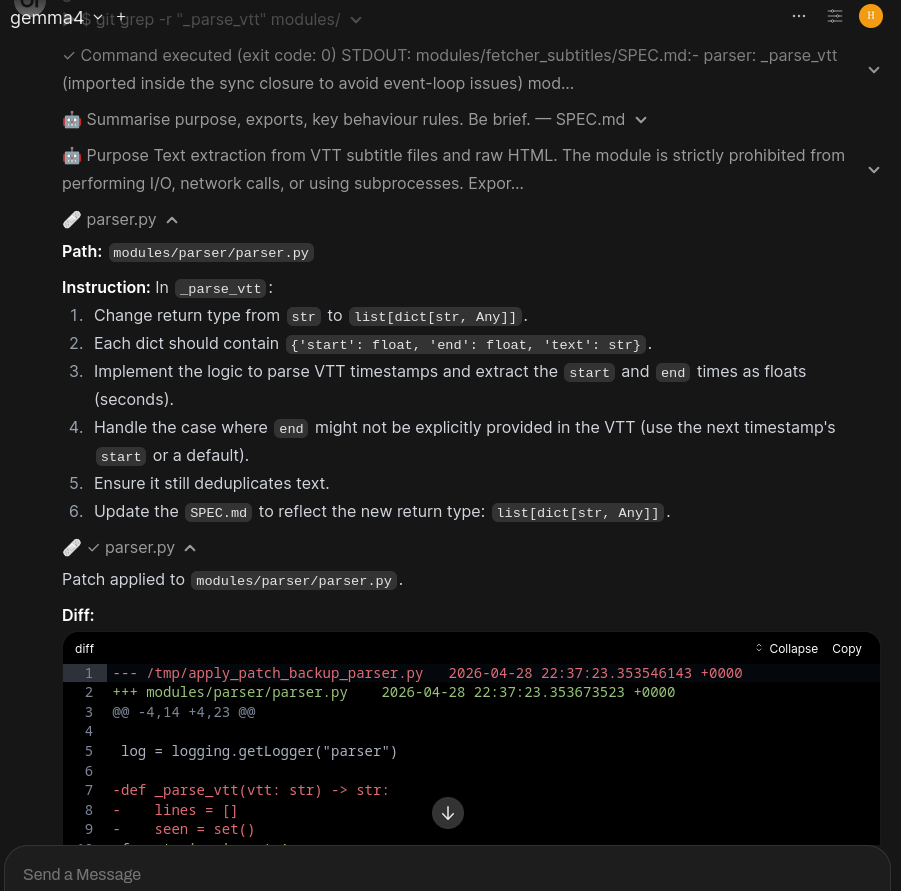

# ollama-proxy

> **WARNING**: This project is an ad-hoc tool. Most of the code has been generated or refactored with AI assistance. Use with caution.

A personal, ad-hoc tool designed to bridge LLMs (via Ollama/llama.cpp) with a local shell environment.

This readme is severely outdated and doesn't explain the current state of the project so have a screenshot for now:

The main feature is a custom agentic workflow in Open WebUI where the LLM can surgically explore and probe your code by running shell commands like grep in your project folder.

It also features a running document plus aggressive context eviction.

This keeps the context small and maintains very quick response times from the LLM as it methodically gathers information and navigates the codebase.

I currently use this with gemma4 26B a4b apex mini quant and it's a very responsive and viable local AI coding workflow.

## Quick Start

1. **Configure**:
   - `cp config.example.toml config.toml`
   - Edit `config.toml` with your service URLs (LLM, Ingestion, Embedding).
   - Make sure to put the skills repo in the dir you specify here.
2. **Start the Proxy**:
   - `python proxy.py` (Ensure your LLM engine is running).
3. **Start the Shell Server**:
   - `export PROXY_URL=http://localhost:11434 && python shell_server.py`
   - You would run this in the root folder of your project, ideally sandboxed so it doesn't have access to anything else. **This can run arbitrary commands on your machine!**

## Skills & Commands

- **Manual Commands**: Start a message with `.` to bypass the LLM and run a command directly (e.g., `.run ls -la`).
- **Skill Triggers**: Use `#` to explicitly trigger agentic skills (e.g., `#code`, `#diff`, `#run`). This ensures reliable activation without relying on semantic intent.
- **Tools**:
    - `ingest_url`: Feed a URL into the RAG knowledge base.
    - `run_shell`: Execute arbitrary commands in the local environment.

## Resources

- **Specifications**: [TECH_SPEC.md](./TECH_SPEC.md) | [DESIGN.md](./DESIGN.md)
- **Skills Repository**: [github.com/Francesco149/skills](https://github.com/Francesco149/skills)
- **Ingestion Server**: [github.com/Francesco149/ingest](https://github.com/Francesco149/ingest)
